# Introduction to Typelevel

## What is Typelevel?

Typelevel is a non-profit organization dedicated to providing principled, type-safe, functional programming tools for the Scala ecosystem. We are hyper-focused on functional programming and building a welcoming, inclusive community around pure functional programming in Scala.

Our mission is to enable the creation of robust, maintainable software through functional programming. We develop and maintain a suite of libraries that help you write safer, more composable, and more testable code.

This introduction starts with ordinary Scala values and functions. From there, we will learn how `map`, `flatMap`, and
for-comprehensions let us combine values without discarding the information carried by their types. 

Finally, we will use those ideas to build a small version of `IO`, the foundational data type from Cats Effect.

You do not need prior experience with functional programming. Every new idea builds on the previous one.

## A Welcoming Community

Building great software goes hand in hand with building a great community. Typelevel is committed to an inclusive,
welcoming, and safe setting for everyone, regardless of background, identity, or experience level. We encourage
collaboration, knowledge sharing, and mentorship through GitHub, Discord, community events, and conferences.

Our [Code of Conduct](https://typelevel.org/code-of-conduct/) describes the standards we expect in every Typelevel space:
be kind and patient, assume good intentions, offer feedback constructively, and respect different experiences and
viewpoints. Whether you are writing your first Scala program or maintaining a functional programming library, you belong
here.

## Let Types Show Your Work

Types are an essential part of Scala and central to the philosophy of Typelevel. If you think back to your professor or teacher in mathematics and physics, they would tell you to “label your work”. A value of `10` could represent 10 meters, 10 seconds, 10 kilograms, or 10 meters per second. The labels provide context and help verify that your calculations are correct. If you expected a result in meters per second but instead got kilometers per second, the labels immediately indicated that something had gone wrong.

Programming follows the same principle. Rather than relying on comments or variable names to describe what a value represents, we use types. A type gives meaning to a value, defines which values are valid, and determines which operations make sense. This philosophy is at the heart of the Typelevel ecosystem.

The Scala Language already has its own types, such as `List`, `Int`, and `String`. Typelevel’s libraries can take it even further.
We start with a simple example, power:

```scala
scala> val loadKw = 1.2
loadKw: Double = 1.2

scala> val energyMwh = 24.2
energyMwh: Double = 24.2

scala> val sumKw = loadKw + energyMwh
sumKw: Double = 25.4
```

In the example above, what stops us from doing this when we use plain numbers? One is a Kilowatt, the other is Megawatt-Hours, and we were attempting to add two numbers that really shouldn’t be added together. Using raw numbers like this is a code smell called _primitive obsession_. We are obsessing over `Double` in this case for everything! This is why we have to show our work with labels in our math and physics homework; the same goes for our programming language. A better option is to use a wrapper around the number; this is called a _value object_.

```scala
scala> val load1: Power = Kilowatts(12)
load1: squants.energy.Power = 12.0 kW

scala> val load2: Power = Megawatts(0.023)
load2: squants.energy.Power = 0.023 MW

scala> val sum = load1 + load2
sum: squants.energy.Power = 35.0 kW

scala> sum == Kilowatts(35)
res0: Boolean = true

scala> sum == Megawatts(0.035) // comparisons automatically convert scale
res1: Boolean = true
```

<small>Try it in <a href="https://scastie.scala-lang.org/5SNhXYrTRxWFp8lR10da7A"></a></small>

Now, our `load1` and `load2` can be added even though one is a `Kilowatt` and the other is a `Megawatt`; the addition operator `+`, which belongs to `Power`, can add them together correctly. We can even assert that the values are equal. This provides you, the programmer, with an extra layer of verification. Making sure the types match can go a long way toward helping you determine whether the program is correct. The example that we just showed is one of Typelevel’s projects called [Typelevel Squants](https://github.com/typelevel/squants)

### Representational Types

A _representational type_ makes a useful fact visible in the type itself. Instead of writing a comment that says “this
list is never empty,” we can use `NonEmptyList` from [Cats](https://github.com/typelevel/cats):

```scala
import cats.data.NonEmptyList

def average(xs: NonEmptyList[Int]): Double =
  xs.reduceLeft(_ + _) / xs.length.toDouble
```

The type tells callers that `average` always has at least one value to work with. Its methods preserve that guarantee when
they can:

```scala
def append[AA >: A](a: AA): NonEmptyList[AA]
```

Adding an element cannot make the collection empty, so `append` returns another `NonEmptyList`. Filtering may remove every
element, so `filter` honestly returns a `List` since it can no longer guarantee that the list is non-empty:

```scala
def filter(p: (A) => Boolean): List[A]
```

You may hear this design goal described as _making illegal states unrepresentable_. For example, we can prevent the
construction of an invalid human age:

```scala
final case class HumanAge private (value: Int)

object HumanAge {
  def from(value: Int): Option[HumanAge] =
    if value >= 0 && value <= 120 then Some(HumanAge(value))
    else None
}

val yodasAge: Option[HumanAge] =
  HumanAge.from(800)
```
<small>Try it in <a href="https://scastie.scala-lang.org/FXe91F5RRquCVnBP444ohA"></a></small>

The result is `None`, so no invalid `HumanAge` is created. Notice how `Option` records a real possibility in the return type: construction may succeed, or it may not. 

## Immutability

Whether we are modeling domain types such as `Human` and `Kilowatts` or working with collections such as `List` and `NonEmptyList`, we generally prefer immutable values. Immutability makes values and their state easier to reason about. Immutable values can also be shared safely between threads without coordinating access to changing state, reducing the need for locks, synchronization, and defensive copying.

Immutability is also a core design principle in functional programming and is strongly emphasized throughout the Typelevel ecosystem.

A `case class` is one typical way that we make an immutable class. 

```scala
final case class User(id: Long, name: String, favoriteLanguageId: Long)
final case class Language(id: Long, name: String)
```

```scala
val cpp = Language(4, "C++")
val scalaLanguage = Language(27, "Scala")
val originalBjarne = User(120, "Bjarne Stroustrup", cpp.id)
```

If we want to create a version of the great Bjarne Stroustrup who prefers Scala, we can use `copy`. Notice that `originalBjarne` is still a C++ programmer; we have merely created a new value with one field changed.

```scala
val newImprovedBjarne = originalBjarne.copy(favoriteLanguageId = scalaLanguage.id)
```

<small>Try it in <a href="https://scastie.scala-lang.org/CKL6DnTRQyuXbKNS3kwsjQ"></a></small>

**WARNING:**
`case class` doesn’t guarantee deep immutability. Its fields are `val` by default, but those fields can still refer to mutable objects.

The important point is that operations on immutable values produce new values instead of changing existing ones. After calling `copy`, both `originalBjarne` and `newImprovedBjarne` remain available, and each retains its own value.

## Method Design

Functional programming favors small functions with a single purpose. When the output type of one function matches the input type of another, we can compose them into a larger function:

```scala
val stringLength: String => Int =
  s => s.length

val isEven: Int => Boolean =
  n => n % 2 == 0

val explain: Boolean => String =
  b => if b then "That number is even" else "That number is odd"

val describeNumber: String => String =
  stringLength.andThen(isEven).andThen(explain)
  
println(describeNumber("42"))
```

<small>Try it in <a href="https://scastie.scala-lang.org/XB9rOtCBTqyN2aLDczceKA"></a></small>


`andThen` reads from left to right: measure the string, test the number, and explain the result. `compose` combines functions in the opposite direction, following the mathematical shape $f(g(x))$:

$$f(g(x)) = y$$  

```scala
val stringLength: String => Int =
  s => s.length

val isEven: Int => Boolean =
  n => n % 2 == 0

val explain: Boolean => String =
  b => if b then "That number is even" else "That number is odd"

val describeNumber: String => String =
  explain.compose(isEven.compose(stringLength))
  
println(describeNumber("42"))
```

<small>Try it in <a href="https://scastie.scala-lang.org/yf3MjF4WQGSLHsjHOG6ZLw"></a></small>

To apply a function, we call the method `apply`. For example, in the above example, we could've called `describeNumber.apply("42")`. `apply` is a magical method, in that Scala lets us omit the word `apply`. 

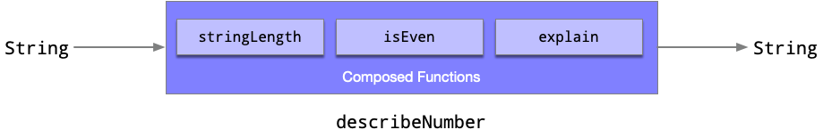

## Transforming Data

### `map`

We have many containers in Scala and in Typelevel; for each of those containers, we can apply a function that manipulates the value(s) in that container to produce another container. That method is called `map`, and `map` applies a function to all values in the container. Let’s take a `List`.

```scala
scala> val result = List(1,2,3,4).map(x => x * 3) 
val result: List[Int] = List(3, 6, 9, 12)
```

<small>Try it in <a href="https://scastie.scala-lang.org/uKdwS69mTpavxhLjvOZM6Q"></a></small>


Another container is `Option`; if we apply a `map` to it, we can change its value, although we aren't changing anything. `map` creates a container and returns it to us.

```scala
scala> val result = Option(2).map(x => x * 3)
val result: Option[Int] = Some(6)
```

<small>Try it in <a href="https://scastie.scala-lang.org/GfpvK3u4Rze8LwiimPR9FA"></a></small>

Here we see an `Option` with `6`, but wait, what is `Some`? Some is one of the children of `Option`, along with its sibling `None`. There are many types in Scala and in the Typelevel stack that are structured this way, where the parent and its children are defined as a closed set, and no classes extend the family. They are called `sealed` types or, if we get nerdy for a bit, an _algebraic data type_.

```scala
sealed abstract class Option[+A] {}
final case class Some[+A](value: A) extends Option[A] {}
case object None extends Option[Nothing] {}
```

### `filter`

The `filter` method retains values that satisfy a predicate and removes those that do not. A predicate is a function that returns `true` or `false`.

```scala
scala> val result = List(1,2,3,4,5).filter(x => x % 2 == 0)
val result: List[Int] = List(2, 4)
```
<small>Try it in <a href="https://scastie.scala-lang.org/b9QkCT1OQCmr7451xZztXA"></a></small>

It becomes interesting when we apply it to an `Option`. If the predicate resolves to `true`, then the value is maintained.

```scala
scala> val result = Option(4).filter(x => x % 2 == 0)
val result: Option[Int] = Some(4)
```

<small>Try it in <a href="https://scastie.scala-lang.org/BBriODIMTF6jO40TbLTRwQ"></a></small>


If it is false, the `Option` becomes `None`.

```scala
scala> val result = Option(3).filter(x => x % 2 == 0)
val result: Option[Int] = None
```

<small>Try it in <a href="https://scastie.scala-lang.org/dNkngQ4kSPWWwHvmjZIwFQ"></a></small>

### `flatMap`

`flatMap` becomes an essential function in everything we do at Scala and at Typelevel. `flatMap` does many wonderful things; one of them is exploding values.

In the following example, notice that for every value it creates a new collection; the signature for `flatMap` for a `List` is `flatMap(A => List[B])`, meaning that every item it may reproduce many items; after it creates multiples, it must flatten them. The following is a `map` where for every element we create multiple elements based on the incoming element.

```scala
scala> val mapped = List(1,2,3).map(x => List(-x, x, x+1))
val mapped: List[List[Int]] = List(List(-1, 1, 2), List(-2, 2, 3), List(-3, 3, 4))
```


Typically, we wouldn't want a `List` of a `List`, although there may be instances that you may. But in this instance, if we didn't want a `List` of a `List`, we can flatten a `List` of `List`s, we get a single list containing all the values.

```scala
val result = mapped.flatten
val result: List[Int] = List(-1, 1, 2, -2, 2, 3, -3, 3, 4)
```

<small>Try it in <a href="https://scastie.scala-lang.org/LWiCSOG2QBWMTxBtmiNCHg"></a></small>

Combining the `map` and `flatten` gives us `flatMap`, so we don't have to do two separate steps, `map` and `flatten`

```scala
val result = List(1,2,3).flatMap(x => List(-x, x, x+1))
val result: List[Int] = List(-1, 1, 2, -2, 2, 3, -3, 3, 4)
```

<small>Try it in <a href="https://scastie.scala-lang.org/Bg5FX7SGT4S8YB4TBEHf0A"></a></small>

With `Option`, `flatMap` lets one lookup determine the next without discarding the possibility that either lookup may fail. Suppose a small program finds a user and then looks up that user’s favorite programming language:

```scala
final case class User(id: Long, name: String, favoriteLanguageId: Long)
final case class Language(id: Long, name: String)

def findLanguage(id: Long): Option[Language] = Option(Language(4, "C++"))
def findUser(id: Long): Option[User] = Option(User(120, "Bjarne Stroustrup", 4))

val favoriteLanguage: Option[String] =
  findUser(120L).flatMap { user =>
    findLanguage(user.favoriteLanguageId).map { language =>
      language.name
    }
  }
```

<small>Try it in <a href="https://scastie.scala-lang.org/yDTVqjBDSuOnuVSKL8Er3A"></a></small>

We never call `get` or pretend that either lookup must succeed. If the user is missing, the second lookup does not run. If the language is missing, the final result is also `None`. Absence stays _in the channel_: it remains visible in the `Option` type throughout the computation.

Scala’s `Either` and `Try`, along with Typelevel data types such as `Validated`, represent other kinds of failure. Each type communicates different error information to its caller.

### For-comprehensions

Scala provides a more readable syntax for a chain of `flatMap` calls ending in `map`:

```scala
final case class User(id: Long, name: String, favoriteLanguageId: Long)
final case class Language(id: Long, name: String)

def findLanguage(id: Long): Option[Language] = Option(Language(4, "C++"))
def findUser(id: Long): Option[User] = Option(User(120, "Bjarne Stroustrup", 4))

val favoriteLanguage: Option[String] =
  for {
    user <- findUser(120L)
    language <- findLanguage(user.favoriteLanguageId)
  } yield language.name

println(favoriteLanguage)
```

<small>Try it in <a href="https://scastie.scala-lang.org/trPquxXcR1iCxlPiBo22aQ"></a></small>

This has the same behavior as the previous example. It returns `Some(name)` only when both lookups succeed.

A for-comprehension can also name an ordinary intermediate value without wrapping it in `Option`:

```scala
val greeting: Option[String] =
  for {
    user <- findUser(42)
    language <- findLanguage(user.favoriteLanguageId)
    message = s"${user.name} likes ${language.name}"
  } yield message
```

<small>Try it in <a href="https://scastie.scala-lang.org/RXTWEtgcSsCmHcB6pQ00Nw"></a></small>

An `if` guard filters the current value. The type used in the for-comprehension must support `withFilter` in addition to `flatMap` and `map`. For `Option`, a `false` predicate causes the result to become `None`.

```scala
val scalaFan: Option[User] =
  for {
    user <- findUser(42)
    language <- findLanguage(user.favoriteLanguageId)
    if language.name == "Scala"
  } yield user
```

<small>Try it in <a href="https://scastie.scala-lang.org/OC7Fy7NGSzCE54invHUDyA"></a></small>

This pattern is applicable beyond `Option`. Types with `flatMap` and `map` can be used in basic for-comprehensions. A comprehension containing an `if` guard also requires `withFilter`.

## Side Effects

A side effect is any observable interaction beyond the return of a value. If a method changes the world, reads from the world, or depends on a hidden state, it is a side effect.

There are many side effects that you would gain a sixth sense at the moment you see them.

| Side Effect         | Example                                  |
|---------------------|------------------------------------------|
| Console I/O         | `println(value)`                         |
| Updating state      | `this.total += amount`                   |
| Files and databases | `Files.write(...), repository.save(...)` |
| Network calls       | `httpClient.send(request)`               |
| Time                | `LocalDate.now(), Instant.now()`         |
| Randomness          | `UUID.randomUUID(), Random.nextInt()`    |
| Exceptions          | `throw new IllegalStateException(...)`   |

For example, the following `greet` method is one that is pure.

```scala
def greet(name:String) = s"Hello, $name"
```
<small>Try it in <a href="https://scastie.scala-lang.org/Wn0kxGJnTeaO1jtn2g4wQw"></a></small>

But the following method is not

```scala
def greetWithSideEffect(name:String) = {
   println("Apply the name")
   s"Hello, $name"
}
```
<small>Try it in <a href="https://scastie.scala-lang.org/o2mie9jNTaW7KyZId66RMg"></a></small>

Having a side effect is not referentially transparent, which we will see next.

## Referential Transparency

An expression is referentially transparent if you can replace it with its evaluated value without changing program behavior. Referential transparency matters to functional and Typelevel programmers. An expression allows you to replace it with its evaluated value without changing program behavior. The next example shows how you can replace `addOne` calls with their returned values without adding extra behavior. Here, you can replace the results of `addOne(41)` and `addOne(42)` with their evaluated values, which makes `result1` and `result2` the same.

```scala
def addOne(x: Int): Int = x + 1

val result1 = addOne(41) + addOne(42)
val result2 = 42 + 43
```

<small>Try it in <a href="https://scastie.scala-lang.org/yYLBy9USRWODO6bsyCsWhg"></a></small>

A term we regularly use to express this is _pure_. For an evaluation to be pure means that it:

1. Evaluates to a value
2. Does not perform side effects
3. Does not depend on a hidden or changing state

Here is some code that is **__not__** referentially transparent. This example comes from one of our favorite books, _the Red Book_, Functional Programming in Scala, Second Edition.

```scala
import java.lang
scala> val x = new lang.StringBuilder("Hello")
x: java.lang.StringBuilder = Hello
 
scala> val r1 = x.append(", World").toString
r1: java.lang.String = Hello, World
 
scala> val r2 = x.append(", World").toString
r2: java.lang.String = Hello, World, World
```
<small>Try it in <a href="https://scastie.scala-lang.org/tVrWmNOGRKuOps0McWiroA"></a></small>

What is sneaky in the above example is that the value `x` is holding onto some mutable state. The calls to `append` mutate state held by `x`, so evaluating the same expression repeatedly produces different observable results.

```scala
class Counter {
    var count = 0
    def increase():Unit = count = count + 1
    def decrease():Unit = count = count - 1
}
```

Running the above, each increase yields a different answer; this would not be referentially transparent, since the object's state changes.

```scala
scala> val counter = Counter()
val counter: Counter = Counter@4b61e97

scala> counter.increase()

scala> counter.increase()

scala> counter.count
val res0: Int = 2
```

<small>Try it in <a href="https://scastie.scala-lang.org/vaQQFlPSTsGJcjbIIGnUNA"></a></small>


@:callout(warning)
Seeing a `var` can be a sign that something is not referentially transparent, but it is not proof by itself. Mutation can remain safely hidden inside a function. The real concern begins when a mutable state is shared or becomes visible to callers.
@:@

A good question, of course, is "Why does it matter?" 

One reason is that it is _easier_ to reason about. Cognitively, we don’t have to think about all the different situations where a method is going to do something that we don’t expect. Let’s take a notorious example in Java that even seasoned programmers will often forget.

```java
import java.util.ArrayList;
import java.util.List;

var numbers = new ArrayList<Integer>(List.of(1, 2, 3));
numbers.addAll(List.of(4, 5));
```

There is a natural reaction to want to assign numbers to some value – we add numbers to an already existing list; give me that list. But it doesn’t work that way; `numbers`, the `ArrayList` has mutated.

Python has the same situation. `numbers` here has mutated, and extend returns `None`

```python
numbers = [1, 2, 3]

numbers.extend([4, 5])
numbers.extend([4, 5])
```

C# also has the same; `numbers` here are mutable.

```csharp
var numbers = new List<int> { 1, 2, 3 };
numbers.AddRange(new[] { 4, 5 });
```

Even our beloved Scala has collections that do the same, `ListBuffer`. 

```scala
import scala.collection.mutable.ListBuffer

val numbers = ListBuffer(1, 2, 3)

numbers.addAll(List(4, 5))
numbers.addAll(List(4, 5))
```
<small>Try it in <a href="https://scastie.scala-lang.org/ir9ge1TJS5uy7yLAPzNC5Q"></a></small>

Alas, most Scala developers will steer clear of doing it this way and instead prefer the standard way, which is referentially transparent. 

Note that in the following, `result1` and `result2` are the same; if we replace the numbers with `List(1, 2, 3)`, we would get the same results.

```scala
val numbers = List(1, 2, 3)
val result1 = numbers ++ List(4,5)
val result2 = numbers ++ List(4,5) 
```

Because neither expression mutates `numbers`, each can be understood independently. This makes pure code easier to compose and reuse: callers do not need to inspect hidden state or wonder whether an operation quietly changed its input.

Referential transparency lets us trust an expression similarly: its value tells the whole story. But real programs must still read files, call services, generate random numbers, and print to the screen. The next section shows how a type can represent those actions without performing them immediately.

## Introducing `IO`

Up until now, we've stated that we like doing things with immutability, representational types, and referential transparency. One thing that sticks out is that we haven’t really covered how to ensure we have all that when it comes to side effects. After all, as you may have guessed, _a side effect is not referentially transparent_. If you print to the screen, that’s a side effect. If the user is unaware that a side effect has occurred, we do not consider it honest.

How do we keep `println` from running before we are ready? We put it in suspense. Instead of printing immediately, we wrap the action in a function and give that function a home inside a type. This little function, which takes no arguments and produces a value, is called a _thunk_. It patiently waits for us to run it.

```scala
final case class NotYet(thunk: () => Unit) {
  def run(): Unit =
    thunk()
}
```

**NOTE:**
If you are familiar with void in other languages, Scala’s `Unit` serves a similar purpose: it indicates that a computation does not produce a meaningful result. Unlike `void`, `Unit` is a real type with exactly one value, `()`.

When you create it, nothing runs; you have contained the side effect. 

```scala
val hello: NotYet =
  NotYet(() => println("Hello"))
```

Only when you run it with `run()` does the side effect get evaluated, not before.

```scala
scala> hello.run()
"Hello"
```

<small>Try it in <a href="https://scastie.scala-lang.org/46IgHq72Q9iONrikOAjDhA"></a></small>


Would this be referentially transparent? We can certainly exercise that idea by adding an `andThen` method on `NotYet` and seeing what happens when we compose the two.

```scala
final case class NotYet(thunk: () => Unit) {
  def run(): Unit =
    thunk()
  def andThen(next: NotYet): NotYet =
    NotYet(() => {
        this.run()
        next.run()
    })
}
```

Combining the two `NotYet` gives us _just an object graph_.

```scala
scala> NotYet(() => println("Hello"))
         .andThen(NotYet(() => println("World")))
val res5: NotYet = NotYet(rs$line$15$NotYet$$Lambda/0x000001c0016fe690@478a9195)
```

Can we combine the three? Yes!

```scala
scala> NotYet(() => println("Hello"))
         .andThen(NotYet(() => println("World")))
         .andThen(NotYet(() => println("Let's Typelevel!")))
val res6: NotYet = NotYet(rs$line$15$NotYet$$Lambda/0x000001c0016fe690@4e9492b6)
```
<small>Try it in <a href="https://scastie.scala-lang.org/3zpwC3D0QYuyDQzWrzsbAQ"></a></small>


Let’s stop here because this is important. Each `NotYet` holds some printing for later. Calling `andThen` joins one `NotYet` to another, but it still does not print anything. The result is another `NotYet`, a larger object built from smaller ones. Only `run()` makes it print.

So yes, building and joining these NotYet values is referentially transparent. Running the result still prints.

We compose data, wire it together, and then wire that to something else. This is a pattern that we will see again and again: build small pieces, join them into something larger, and run the whole thing when we are ready.

Another thing to notice is the following `NotYet(rs$line$15$NotYet$$Lambda/0x000001c0016fe690@4e9492b6)` when running in the Scala REPL. This represents an object graph. Everything is data. The more you do this style of programming, the more common you will notice that most of what we do is build objects upon objects until it is time to run.

Time to make a few adjustments; first, I am going to rename `run` to something with a touch of a warning, `unsafeRunSync`. This new term means I wish to run this object graph, **but**, by doing so, we are warning our end user that some side effects may occur. The `sync` indicates that the call waits for the result before returning.

```scala
final case class NotYet(thunk: () => Unit) {
  def unsafeRunSync(): Unit =
    thunk()
  def andThen(next: NotYet): NotYet =
    NotYet(() => {
        this.unsafeRunSync()
        next.unsafeRunSync()
    })
}
```

Running the application we created:

```scala
scala> NotYet(() => println("Hello"))
          .andThen(NotYet(() => println("World")))
          .andThen(NotYet(() => println("Let's Typelevel!")))
val res6: NotYet = NotYet(rs$line$15$NotYet$$Lambda/0x000001c0016fe690@4e9492b6)
scala> res6.unsafeRunSync()
Hello
World
Let's Typelevel
```

<small>Try it in <a href="https://scastie.scala-lang.org/4JLxSEMiSgWeUtZ4qqMmKg"></a></small>

The problem with `andThen` is that it is good when I want to discard the first part and continue to the second, or a third, like in our `"Hello"`, `"World"`, `"Let's Typelevel"`. We did not need `Hello` to build `World`, and I didn’t need `World` for Let's `Typelevel`. But what if we did? In the following example, let’s throw two dice with `NotYet`.

Our first `NotYet` could produce only `Unit`. Let’s parameterize it so that it can produce any type: an `Int`, a `String`, or a custom `Account`.

```scala
final case class NotYet[A](thunk: () => A) {
  def unsafeRunSync(): A =
    thunk()
  def andThen(next: NotYet[A]): NotYet[A] =
    NotYet(() => {
        this.unsafeRunSync()
        next.unsafeRunSync()
    })
}
```

Our previous `Hello`, `World`, `Let's Typelevel!` should still work even by making this flexible:

```scala
scala> NotYet(() => println("Hello")).andThen(NotYet(() => println("World"))).andThen(NotYet(() => println("Let's Typelevel!")))
val res8: NotYet[Unit] = NotYet(
  rs$line$20$NotYet$$Lambda/0x000001c001723678@2c0fd54c
)
```
<small>Try it in <a href="https://scastie.scala-lang.org/eUINIivJRfyTPEwWH7hchg"></a></small>


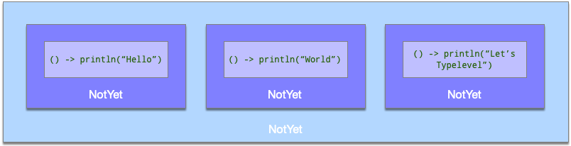

But we are moving over to dice. Dice are random, or they should be, and chaos needs to be put into a function. It is a side effect.

```scala
val random = scala.util.Random
NotYet(() => random.nextInt())
```

<small>Try it in <a href="https://scastie.scala-lang.org/fXKMsPtDSTKxv3K2wn4Vaw"></a></small>

The issue now, though, is how I take that number and use it in another part of a chain, and on and on and on? Remember, the `println` were just individual calls, and we threw away the result of `Hello` because it returned Unit and really didn’t need to. Now, I need that number, and `andThen` will not cut it. Take your time with it.

The answer is `flatMap` and `map`. Remember previously that things are just a composition of the components. Let’s add it!

```scala
final case class NotYet[A](thunk: () => A) {
  def unsafeRunSync(): A =
    thunk()
  
  def andThen(next: NotYet[A]): NotYet[A] =
    NotYet(() => {
        this.unsafeRunSync()
        next.unsafeRunSync()
    })
  
  def map[B](f: A => B): NotYet[B] =
    NotYet(() => f(this.unsafeRunSync()))

  def flatMap[B](f: A => NotYet[B]): NotYet[B] =
    NotYet(() => f(this.unsafeRunSync()).unsafeRunSync()) 
}
```

I don’t know about you, but between you and me, I think we have the makings of a new Typelevel project. Take a few minutes to really let this one sink in.

Let's roll a die

```scala
import scala.util.Random

val rollDie: NotYet[Int] =
  NotYet(() => Random.between(1, 7))
```

`rollDie` is just an object; nothing is happening. We suspended the _side effect_.

```scala
val rollDie: NotYet[Int] = NotYet(
  rs$line$5$$$Lambda/0x000001fe015ed0e0@3ac3cae8
)
```

We run it by calling `unsafeRunSync()`. Up to this point, `rollDie` was just a value and no die had been rolled. Calling `unsafeRunSync()` crosses that line and performs the suspended random action. Calling it again may produce a different number, so the call is not referentially transparent. Hence, _unsafe_.

```scala
scala> rollDie.unsafeRunSync()
val res1: Int = 3
```

<small>Try it in <a href="https://scastie.scala-lang.org/ijbbKkPQQSWLBSyPSm43rA"></a></small>


We brought `flatMap` and `map` into all this for a reason: _to compose_. Take a value from one die roll and compose it to another die roll. This is where `flatMap` is always our tool of choice.

```scala
scala> val rollDice: NotYet[(Int, Int)] =
          NotYet(() => Random.between(1, 7))
            .flatMap(firstRoll => NotYet(() => Random.between(1, 7))
            .map(secondRoll => (firstRoll, secondRoll)))

val rollDice: NotYet[(Int, Int)] = NotYet(
  rs$line$3$NotYet$$Lambda/0x000001fe01713358@4705bd7a
)            
```

Here we see a lambda; once again, no dice have been rolled. We have only built `rollDice`. Calling `unsafeRunSync()` rolls the dice, so each run may produce different numbers.

```scala
scala> rollDice.unsafeRunSync()
val res7: (Int, Int) = (3, 6)
```

<small>Try it in <a href="https://scastie.scala-lang.org/O7MTWjDURteRYWh6mappTg"></a></small>

Remember that with a `flatMap`, we can make it a little more elegant using a for-comprehension, given that we are using the many `flatMap`s and one `map` pattern.

```scala
scala> val rollDice: NotYet[(Int, Int)] = 
         for {
             firstRoll <- NotYet(() => Random.between(1,7))
             secondRoll <- NotYet(() => Random.between(1,7))
         } yield (firstRoll, secondRoll)
       
val rollDice: NotYet[(Int, Int)] = NotYet(
  rs$line$3$NotYet$$Lambda/0x000001fe01713358@329fdc4e
)          
```


Rolling the die should still work as before since for-comprehension is used for this purpose.

```scala
scala> rollDice.unsafeRunSync()
val res7: (Int, Int) = (3, 6)
```
<small>Try it in <a href="https://scastie.scala-lang.org/D90w2pcpRRK81yJnou1erA"></a></small>

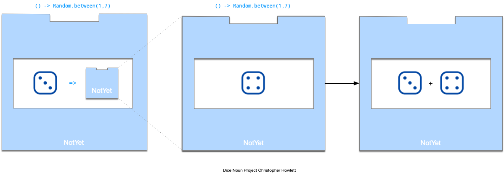


Let’s do something electrifying! Let’s keep rolling a pair of dice until we get a lucky number 7. How do we make a loop for this? Let’s try to create a recursive method until we hit the desired base case. One thing to keep in mind is that we want to do this without running anything. We want to set up a lambda.

```scala
def rollUntil(notYet: NotYet[(Int, Int)]): NotYet[(Int, Int)] = {
    if (???) {

    }
}
```

Therefore, we can’t start with an `if`. If you look at the following example, we cannot hook into any value; we do need a `flatMap` first.

```scala
def rollUntil(notYet: NotYet[(Int, Int)]): NotYet[(Int, Int)] = {
    notYet.flatMap{ case (firstRoll, secondRoll) => 
       if (firstRoll + secondRoll == 7) 
          NotYet(() => (firstRoll, secondRoll))
       else 
          rollUntil(rollDice)
    }
}
```

Let’s refactor some of this and make it look decent. One thing we notice is `NotYet(() => (firstRoll, secondRoll))`; we can create a method called `pure` and put that into an object. Pure is a special method that we often mean “here is the value. No side effect or suspension required”.

```scala
object NotYet {
   def pure[A](a:A):NotYet[A] = NotYet(() => a)
}
```

```scala
def rollUntil(notYet: NotYet[(Int, Int)]): NotYet[(Int, Int)] = {
    notYet.flatMap{ case (firstRoll, secondRoll) => 
       if (firstRoll + secondRoll == 7) 
          NotYet.pure((firstRoll, secondRoll))
       else 
          rollUntil(rollDice)
    }
}
```

<small>Try it in <a href="https://scastie.scala-lang.org/nilAKdieQiexXFrKHBHdUQ"></a></small>


Next, we can use a for-comprehension to break out the first and second rolls and clarify them. Each expression to the right of `<-` must produce a `NotYet`, although the value inside the `NotYet` may have a different type.

We can also make an aside assignment inside the for-comprehension without using `<-`. This is useful for a small calculation along the way. In our case, we calculate `total` before deciding whether to roll again.

```scala
def rollUntil(notYet: NotYet[(Int, Int)]): NotYet[(Int, Int)] =
  for {
    rolls @ (firstRoll, secondRoll) <- notYet
    total = firstRoll + secondRoll
    result <-
      if total == 7 then
        NotYet.pure(rolls)
      else
        rollUntil(rollDice)
  } yield result
```

As a final touch, we can use an inner method to handle the recursion; we can call a single method to do exactly what we need.


```scala
def rollUntil(target: Int): NotYet[(Int, Int)] = {
  def loop(notYet: NotYet[(Int, Int)]): NotYet[(Int, Int)] =
    for {
      rolls @ (firstRoll, secondRoll) <- notYet
      total = firstRoll + secondRoll
      result <-
        if total == target then
          NotYet.pure(rolls)
        else
          loop(rollDice)
    } yield result

  loop(rollDice)
}
```

<small>Try it in <a href="https://scastie.scala-lang.org/MYEDgM4LRsuTBIjI9ynhXw"></a></small>


### We still don't like it. 

There is something wrong. Don’t you feel it? Sure, we have laziness, but it still feels dirty. Having `unsafeRunSync` up in the data definition of `NotYet` is smelly. Can we do better?

#### `sealed` types to the rescue

So far our previous answer had three distinct ideas:

* `pure`, which is a pure computation, no side effects or things we need to suspend
* `delay`, which is something we do need to delay because of perhaps a side effect, and we have to keep it from running
* `flatMap`, which we use for for-comprehensions

Let’s take all three ideas and create true data, with no `unsafeRunSync` mixed into any of this.  Here we will create a `sealed trait`. What is `sealed`? `sealed` is used when you are declaring a contract, such as in a `trait` or an `abstract class`, where children must be declared. The difference with sealed is that we, as the designers, are already creating all the possible children; _no one else does_. In the following example, we declare our parent `trait` `sealed`.

```scala
sealed trait NotYet[A]

final case class Pure[A](value: A) extends NotYet[A]

final case class Delay[A](thunk: () => A) extends NotYet[A]

final case class FlatMap[A, B](
    source: NotYet[A],
    continue: A => NotYet[B]
) extends NotYet[B]
```

Instead of hiding the entire program inside one function, we will use immutable classes to show its different pieces. `Pure` holds a value, `Delay` holds work for later, and `FlatMap` joins one `NotYet` to the next.

How does this look for our dice? Well, for rolling one die, this becomes the following.

```scala
Delay(() => Random.between(1, 7))
```

<small>Try it in <a href="https://scastie.scala-lang.org/1Jd5rEwZSiu0R4cgDIWfRg"></a></small>


For rolling two dice, this becomes this magnificent object graph; note, once again, that nothing is running.

```scala
import scala.util.Random

val rollDice: NotYet[(Int, Int)] =
  FlatMap(
    Delay(() => Random.between(1, 7)),
    firstRoll =>
      FlatMap(
        Delay(() => Random.between(1, 7)),
        secondRoll =>
          Pure((firstRoll, secondRoll))
      )
  )
```

<small>Try it in <a href="https://scastie.scala-lang.org/nRR2mWn3QdCAcdpVTULdxg"></a></small>


Let’s stop for an important point. Many of the libraries that we have in Typelevel do exactly this. We construct object graphs, a lot of object graphs. Once constructed, we will then interpret what we do with that object graph. This is called the **__interpreter pattern__**. Everything up to this point is data. That’s it, and once you see it, then the complexity will fade. It is intimidating at first because the code can look overwhelming, but there is nothing now that should stand in your way.

An analogy that is worth throwing in here is punch cards. In the older days of computing, these were programs. Programmers had to prepare these cards to load them onto a machine – a machine to interpret what those cards wanted.  We are doing the same thing: we are describing what we want our program to do, and we will send it to be interpreted by an interpreter like `unsafeRunSync()`


<div style="text-align: center;">
  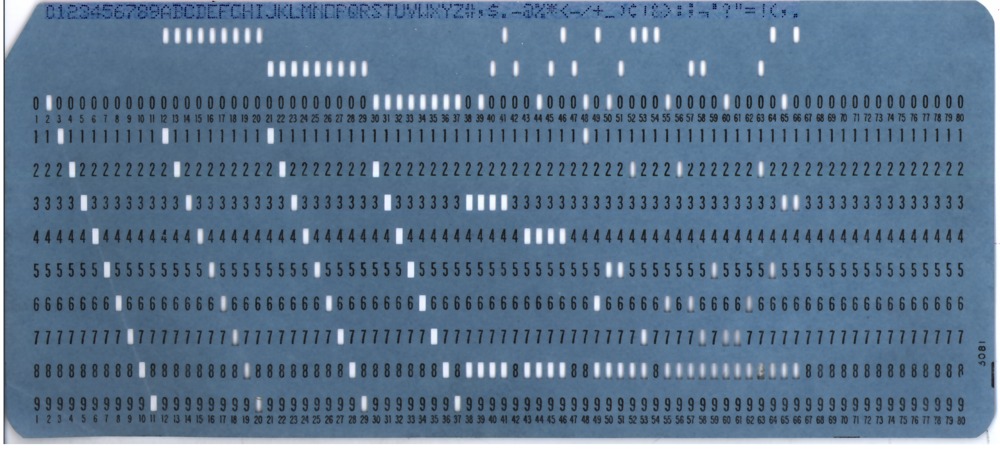
  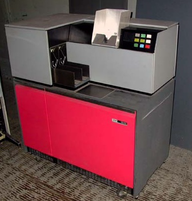
  <p style="font-size: 0.75em; margin-top: 0.5em;">
    Images from <a href="https://en.wikipedia.org/wiki/Punched_card_input/output">Wikipedia: Punched card input/output</a>
  </p>
</div>

Our brains can appreciate the graph for viewing but not for typing it out by hand, so we can use some help here. We will throw in some methods to make life easier, and we can go back to using for comprehensions.

```scala
sealed trait NotYet[A] {
  def flatMap[B](f: A => NotYet[B]): NotYet[B] =
    FlatMap(this, f)

  def map[B](f: A => B): NotYet[B] =
    FlatMap(this, a => Pure(f(a)))
  

}

final case class Pure[A](value: A) extends NotYet[A]

final case class Delay[A](thunk: () => A) extends NotYet[A]

final case class FlatMap[A, B](
    source: NotYet[A],
    continue: A => NotYet[B]
) extends NotYet[B]

object NotYet {
  def pure[A](value: A): NotYet[A] =
    Pure(value)

  def delay[A](value: => A): NotYet[A] =
    Delay(() => value)
    
  def println(str: String): NotYet[Unit] = 
    Delay(() => _root_.scala.Predef.println(str))
}
```

NOTE:
The `=>` marks value as a by-name parameter. It lets us give delay some code to run later without wrapping that code in `() =>`. The `delay` method takes care of wrapping it in a `thunk` for us.

Now that we have some helpers with constructors, `flatMap`, `map`, and a `println`, we can simplify how we do everything. Here is `rollDice`

```scala
import scala.util.Random

val rollDice: NotYet[(Int, Int)] =
  for {
    firstRoll <- NotYet.delay(Random.between(1, 7))
    secondRoll <- NotYet.delay(Random.between(1, 7))
  } yield (firstRoll, secondRoll)
```

Our `rollUntil` can stay the same.

```scala
def rollUntil(target: Int): NotYet[(Int, Int)] = {
  def loop(notYet: NotYet[(Int, Int)]): NotYet[(Int, Int)] =
    for {
      rolls @ (firstRoll, secondRoll) <- notYet
      total = firstRoll + secondRoll
      result <-
        if total == target then
          NotYet.pure(rolls)
        else
          loop(rollDice)
    } yield result

  loop(rollDice)
}
```

This is exciting; now, when you call `rollUntil` you get something deliciously surprising. You get an object graph. That’s it! Congratulations.

```scala
scala> rollUntil(7)
val res1: NotYet[(Int, Int)] = FlatMap(
  source = FlatMap(
    source = Delay(rs$line$3$$$Lambda/0x000001fe011ad800@22a97a1e),
    continue = rs$line$3$$$Lambda/0x000001fe017c0cf0@b8c2c34
  ),
  continue = rs$line$4$$$Lambda/0x000001fe0188ed60@c3a55ce
)
```

<small>Try it in <a href="https://scastie.scala-lang.org/sAy37DuiTA2DOa9QUpLAwQ"></a></small>

We need to run it, or correctly say _interpret it_. Remember the punch-card analogy? We just described what we wanted; now we interpret it. I am going to rewrite `unsafeRunSync()`, but it is not inside `NotYet`; it is outside. We do not want interpretation inside data.

```scala
object Runner {
  def unsafeRunSync[A](notYet: NotYet[A]): A =
    notYet match {
      case Pure(value) =>
        value

      case Delay(thunk) =>
        thunk()

      case FlatMap(source, continue) =>
        val value = unsafeRunSync(source)
        unsafeRunSync(continue(value))
    }
}
```

Get the popcorn ready. Here we go.

```scala
scala> Runner.unsafeRunSync(rollUntil(7))
val res2: (Int, Int) = (2, 5)
```

<small>Try it in <a href="https://scastie.scala-lang.org/t8d2F1e6SiGjDvhCQRRHfQ"></a></small>


C'mon bring it in. We did it. *Hugs* 

That looks amazing. 

We have data separation and interpretation. How about we add some `println`s and make a complete program out of it! A program, which by the way, is also data.

```scala
val program: NotYet[(Int, Int)] =
  for {
    _ <- NotYet.println("About to roll some dice until I get a 7...")
    rolls <- rollUntil(7)
    _ <- NotYet.println(s"Got a 7 with rolls: $rolls")
  } yield rolls
```

Running the program and we get some output

```scala
scala> Runner.unsafeRunSync(program)

About to roll some dice until I get a 7...
Got a 7 with rolls: (1,6)
```

<small>Try it in <a href="https://scastie.scala-lang.org/IJo1i4bNSLuScs4iYWeFAQ"></a></small>


And, now, the ultimate refactoring. I am going to rename `NotYet` to `IO`, and while I am at it, I am going to move the `unsafeRunSync` to `IO` and get rid of runner. I just put it on the outside, previously, for demonstration.

```scala
sealed trait IO[A] {
  def flatMap[B](f: A => IO[B]): IO[B] =
    FlatMap(this, f)

  def map[B](f: A => B): IO[B] =
    FlatMap(this, a => Pure(f(a)))
}

final case class Pure[A](value: A) extends IO[A]

final case class Delay[A](thunk: () => A) extends IO[A]

final case class FlatMap[A, B](
    source: IO[A],
    continue: A => IO[B]
) extends IO[B]

object IO {
  def pure[A](value: A): IO[A] =
    Pure(value)

  def delay[A](value: => A): IO[A] =
    Delay(() => value)

  def println(str: String): IO[Unit] =
    Delay(() => _root_.scala.Predef.println(str))

  def unsafeRunSync[A](io: IO[A]): A =
    io match {
      case Pure(value) =>
        value

      case Delay(thunk) =>
        thunk()

      case FlatMap(source, continue) =>
        val value = unsafeRunSync(source)
        unsafeRunSync(continue(value))
    }
}
```

`rollDice` becomes

```scala
import scala.util.Random

val rollDice: IO[(Int, Int)] =
  for {
    firstRoll <- IO.delay(Random.between(1, 7))
    secondRoll <- IO.delay(Random.between(1, 7))
  } yield (firstRoll, secondRoll)
```

`rollUntil` becomes...

```scala
def rollUntil(target: Int): IO[(Int, Int)] = {
  def loop(io: IO[(Int, Int)]): IO[(Int, Int)] =
    for {
      rolls @ (firstRoll, secondRoll) <- io
      total = firstRoll + secondRoll
      result <-
        if total == target then
          IO.pure(rolls)
        else
          loop(rollDice)
    } yield result

  loop(rollDice)
}
```

and our final program becomes...

```scala
val program: IO[(Int, Int)] =
  for {
    _ <- IO.println("About to roll some dice until I get a 7...")
    rolls <- rollUntil(7)
    _ <- IO.println(s"Got a 7 with rolls: $rolls")
  } yield rolls
```

`program` is now represented as an object graph with lambdas; nothing runs at this point.

```scala
val program: IO[(Int, Int)] = FlatMap(
  source = Delay(rs$line$14$IO$$$Lambda/0x000001fe018a4ec8@1ffd4518),
  continue = rs$line$17$$$Lambda/0x000001fe018a51b0@bf7e3a
)
```

Finally, we run it, nay, we _interpret it_.

```scala
val result: (Int, Int) =
         IO.unsafeRunSync(program)
```

```text
About to roll some dice until I get a 7...
Got a 7 with rolls: (3,4)

val result: (Int, Int) = (3, 4)
```

<small>Try it in <a href="https://scastie.scala-lang.org/Axwm1RXeSBO4wTIMPhJezQ"></a></small>

Cheers all around! We just loosely reinvented the basic shape of `IO`, a foundational type from Cats Effect. `IO` lets us build and combine work such as printing and generating random numbers without doing that work immediately. *We decide* when the complete program is finally run.

**NOTE:** 
This `IO` is a teaching model. Cats Effect’s `IO` provides stack-safe composition, cancellation, concurrency, resource-safety tools, and many other capabilities. Our version is intended only to demonstrate how effectful programs can be represented as data and interpreted later.


You now know everything. Go forth, and program! But wait! A few more things.

### Understanding Effects

We discussed side effects previously, such as printing to the screen, changing state, and generating random values. A functional effect is a computing behavior represented explicitly in a type. Instead of having only a value of type `A`, we have a value in some context, such as `Option[A]`, `Future[A]`, or `IO[A]`.

Each effect conveys different behavior. An `Option[A]` represents a value that may be absent; a `Future[A]` represents a value that may become available later. An `IO[A]` represents a computation that will produce an `A` when it is run. When you encounter a type with a shape like `F[A]`, it is worth asking what behavior or environment the outer type adds to `A`.

### Programs, Algebras, and Data

There are some other wild terms we use that sound scary but are not, and you should know what they are so you can be more comfortable reading our material.

#### Programs

A program is the composition of smaller functions to create a grander-style application. That’s it. An important facet is that a program is just data. We saw that in our example for our custom `IO[A]`

```scala
val program: IO[(Int, Int)] =
  for {
    _ <- IO.println("About to roll some dice until I get a 7...")
    rolls <- rollUntil(7)
    _ <- IO.println(s"Got a 7 with rolls: $rolls")
  } yield rolls
```

When we see the representation, nothing runs; the program is just data. The final application representation, called a _program_, is ready to be _interpreted_.

```scala
val program: IO[(Int, Int)] = FlatMap(
  source = Delay(rs$line$14$IO$$$Lambda/0x000001fe018a4ec8@1ffd4518),
  continue = rs$line$17$$$Lambda/0x000001fe018a51b0@bf7e3a
)
```

<div style="text-align: center;">
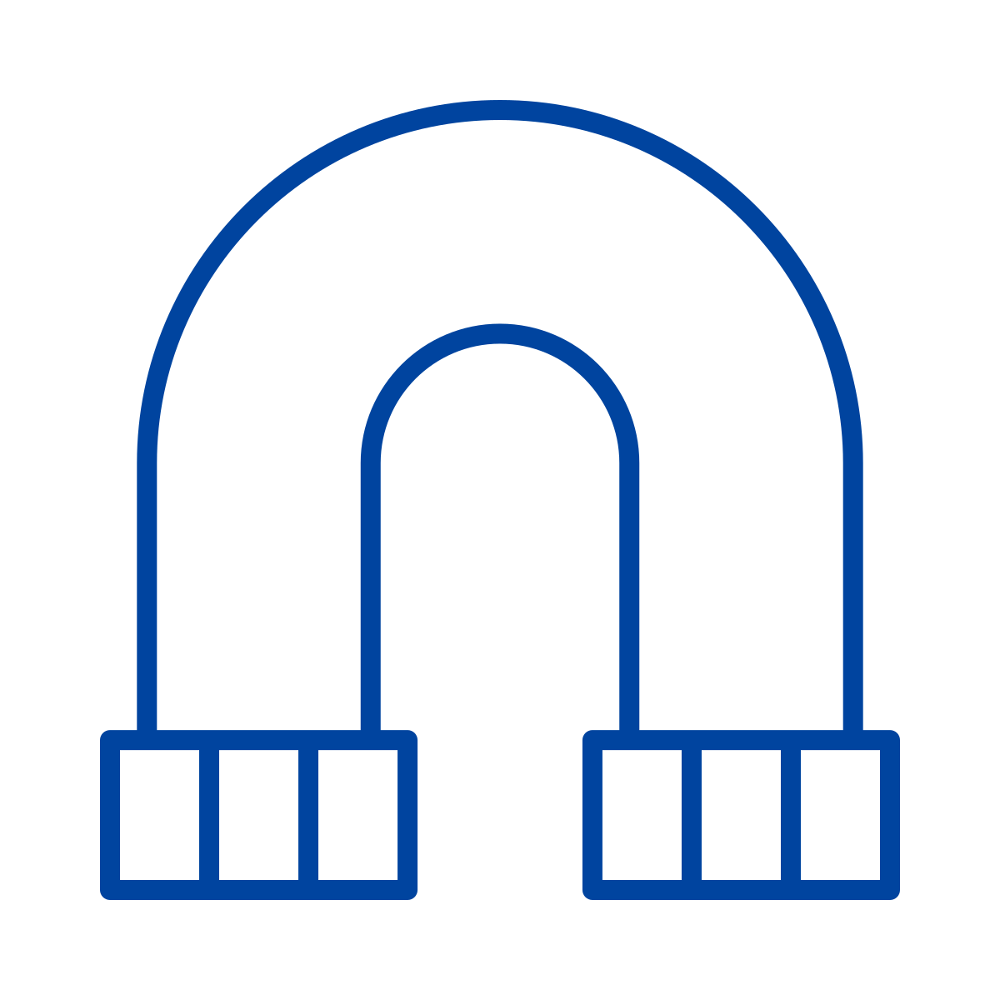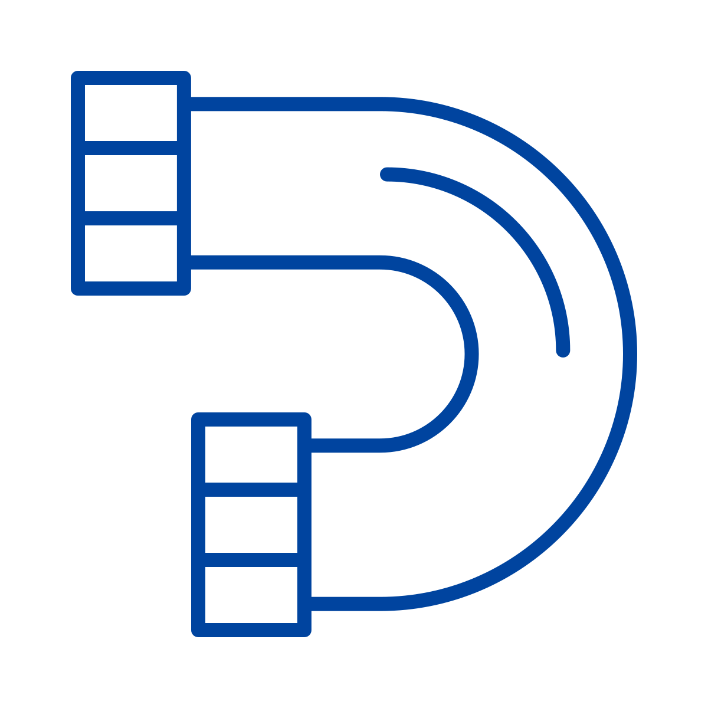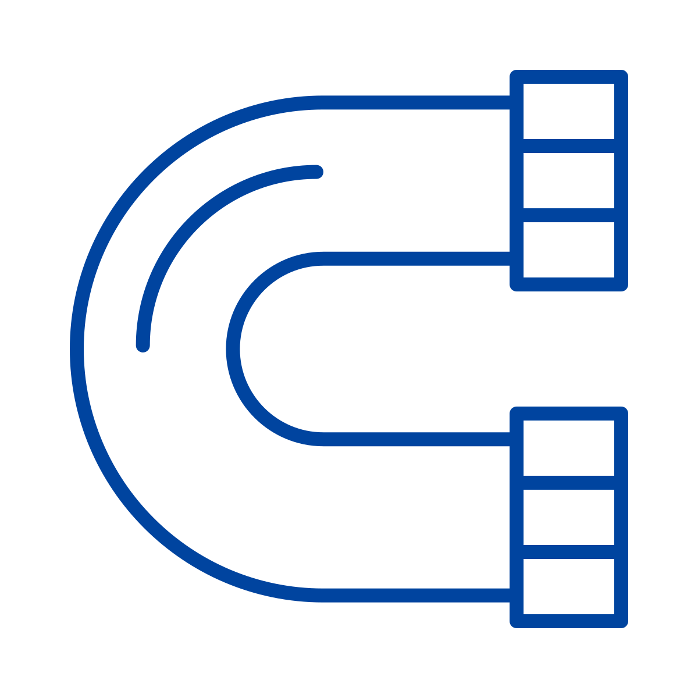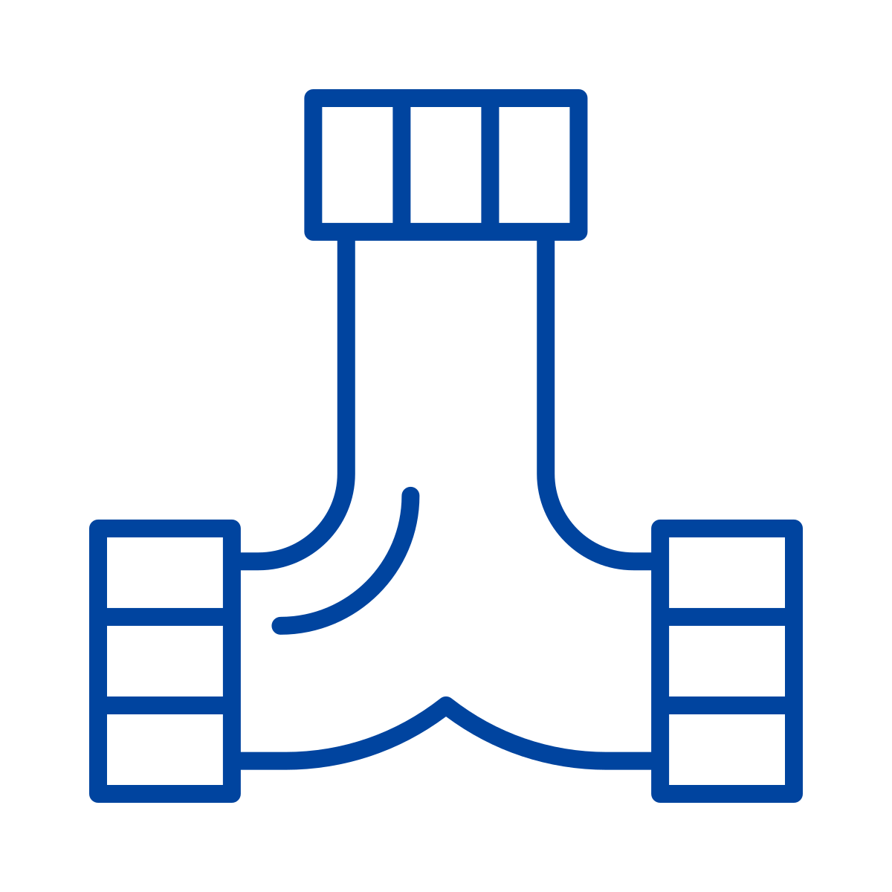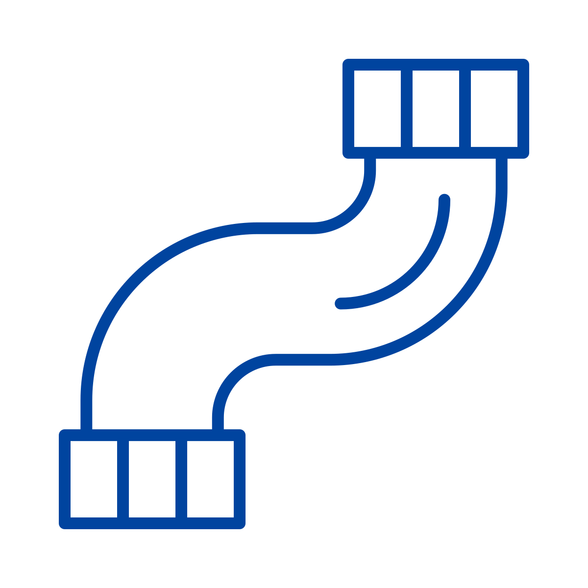
</div>

<small>Pipe Images from Noun Project. Artist Made x Made</small>


#### Algebras

Another term we throw around is _algebra_. An algebra describes the contract for how a program should run. For example, a TODO algebra might provide operations for adding, completing, and listing TODO items. The algebra defines the program’s vocabulary while leaving the details of how those operations are performed to an implementation likely using an effect.

```scala
trait Todos {
  def add(description: String): IO[Unit]
  def complete(id: Long): IO[Unit]
  def list: IO[List[Todo]]
}
```

#### Interpreters

An interpreter takes the data we assembled and runs it for a purpose, much like the punch-card machine we saw earlier. _We assembled our program as data, and now the interpreter turns it on._

Suppose we created a sealed type language in Scala for SQL. 

```scala
sealed trait SQL

final case class SELECT(
  columns: List[String],
  from: String,
  where: Option[Condition] = None
) extends SQL

final case class INSERT(
  into: String,
  values: List[(String, SQLValue)]
) extends SQL

final case class UPDATE(
  table: String,
  set: List[(String, SQLValue)],
  where: Option[Condition] = None
) extends SQL
```

We would need some definitions for `SQLValue`

```scala
sealed trait SQLValue

object SQLValue {
  final case class Text(value: String) extends SQLValue
  final case class Number(value: Long) extends SQLValue
  final case class Bool(value: Boolean) extends SQLValue
}
```

We would need to define some conditions for our internal SQL language.

```scala
sealed trait Operator

object Operator {
  case object Equal              extends Operator
  case object NotEqual           extends Operator
  case object GreaterThan        extends Operator
  case object GreaterThanOrEqual extends Operator
  case object LessThan           extends Operator
  case object LessThanOrEqual    extends Operator
}
```

And finally a `Condition` that expresses what we are looking for:

```scala
final case class Condition(
  column: String,
  operator: Operator,
  value: SQLValue
)
```

Given our language, we can construct a SQL right in Scala:

```scala
val findIncompleteTodos: SQL =
  SELECT(
    columns = List("id", "description", "completed"),
    from = "todos",
    where = Some(
      Condition(
        column = "completed",
        operator = Operator.Equal,
        value = SQLValue.Bool(false)
      )
    )
  )
```

How do we interpret the SQL? We can interpret to only show the results in a pretty printer.

```scala
scala> def interpretPrettyPrint(sql: SQL): String = ???
def interpretPrettyPrint(sql: SQL): String

scala> interpretPrettyPrint(findIncompleteTodos)
val res22: String = SELECT id, description, completed
FROM todos
WHERE completed = false
```

Or we can actually run it against a database with our frameworks Doobie or Skunk.

```scala
scala> def interpretPostgres(
     |   sql: SQL
     | ): IO[List[(Long, String, Boolean)]] = ???
def interpretPostgres(sql: SQL): IO[List[(Long, String, Boolean)]]

scala> val query =
     |   interpretPostgres(findIncompleteTodos)
val query: IO[List[(Long, String, Boolean)]] = ...

scala> IO.unsafeRunSync(query)
val res25: List[(Long, String, Boolean)] = List(
  (1L, "Learn Cats Effect", false),
  (2L, "Write the introduction", false)
)
```

Or we can run in an InMemoryDatabase

```scala
def interpretInMemory(sql: SQL): Option[List[TodoRow]] = ???
```

<small>Try it in <a href="https://scastie.scala-lang.org/qkVE9IVNQLOnW7a5TK4lZA"></a></small>

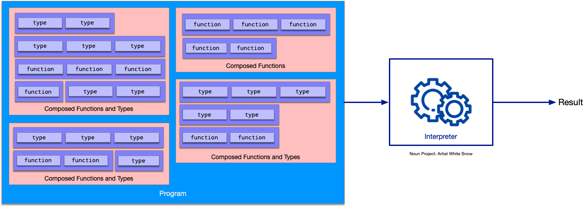


You can create a whole host of languages that do things and then let the interpreter decide how to run them! Think databases, web frameworks, business processes, testing frameworks, and a lot more!

### The Typelevel Ecosystem

The Typelevel ecosystem consists of several libraries that work together to enable pure functional programming in Scala.

- **Cats**: The basic library providing abstractions for functional programming, including type classes like `Functor`, `Monad`, and `Applicative`, along with useful data types.

- **Cats Effect**: A powerful effect system for managing side effects in a referentially transparent way, centered around the `IO` type that you learned about in this guide.

- **FS2**: A streaming library for building compositional, effectful data pipelines with powerful resource management and backpressure handling.

- **HTTP4s**: A minimal, idiomatic HTTP library built on functional programming principles, perfect for building web services and clients.

- **Circe**: A JSON library that uses type classes and functional programming to provide safe, composable JSON encoding
  and decoding.

- **Doobie**: A principled database access library that brings functional programming to JDBC.

- **Skunk**: A data access library for Postgres built on Cats Effect, providing a purely functional alternative to JDBC.

Many use the same concepts that we covered in this introduction, like creating functions, then composing functions to create larger functions, to create programs, all of which are data. Data again represents just object graphs, and finally, running it through an interpreter. Each library has its own descriptive type and multiple ways to interpret that data.

| Library     | Main descriptive type                  | What it describes                                       | Common way to interpret or run it                    |
|-------------|----------------------------------------|---------------------------------------------------------|------------------------------------------------------|
| Cats Effect | `IO[A]`                                | A computation that produces an `A`                      | `IOApp`; `unsafeRunSync()` for REPL experiments      |
| FS2         | `Stream[F, A]`                         | An effectful stream of `A` values                       | `compile.toList`, `compile.drain`, or `compile.last` |
| http4s      | `HttpRoutes[F]` or `HttpApp[F]`        | How HTTP requests should be handled                     | A server backend such as `EmberServerBuilder`        |
| Circe       | `Json`, `Encoder[A]`, and `Decoder[A]` | JSON data and conversions between JSON and Scala values | `asJson`, `json.as[A]`, or `decode[A](text)`         |

While the list above shows some of our core libraries and frameworks, we have many more. Take a look at our [projects page](https://typelevel.org/projects/) and see if something interests you further.

### Conclusion

Typelevel’s products may seem large and foreboding, including some of our terminology. The ideas underneath them all begin small; we compose these functions into larger programs, and along the way the compiler helps us stay in check.

We learned why concepts like purity and referential transparency matter to us. Code is easier to understand when an expression doesn’t produce hidden surprises. Real-life applications still need features like randomness, databases, file reads and writes, ID generation, and state changes. We recognize that they are needed, but we can program them responsibly.  So we describe all these using an effect as we described in this introduction.

All these patterns are employed in the Typelevel ecosystem. Cats provide useful data types and tools for composition. Cats Effect gives us IO. FS2 describes streams, http4s describes HTTP applications, Circe describes JSON conversions, and Doobie and Skunk describe database work. Each library applies the same broad idea to a different problem: describe small pieces, compose them into a program, and interpret that program at the proper boundary.

You do not need to know every abstraction before getting started. Begin with the types in front of you. Ask what they represent, what guarantees they provide, and what the surrounding context adds to the value inside. Then use `map`, `flatMap`, and `for`-comprehensions to assemble those small pieces into something larger.

Typelevel is not only a collection of libraries. It is a community of people learning, teaching, and building together. Wherever you are on your functional programming journey, you are welcome to ask questions, explore the projects that interest you, and contribute when you are ready. Start small, compose what you have, and build from there.
